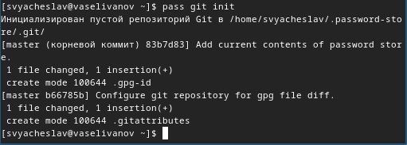

---
## Front matter
lang: ru-RU
title: Структура научной презентации
subtitle: Простейший шаблон
author:
  - Селиванов В.А.
institute:
  - Российский университет дружбы народов, Москва, Россия
  - Объединённый институт ядерных исследований, Дубна, Россия
date: 16 марта 

## i18n babel
babel-lang: russian
babel-otherlangs: english

## Formatting pdf
toc: false
toc-title: Содержание
slide_level: 2
aspectratio: 169
section-titles: true
theme: metropolis
header-includes:
 - \metroset{progressbar=frametitle,sectionpage=progressbar,numbering=fraction}
 - '\makeatletter'
 - '\beamer@ignorenonframefalse'
 - '\makeatother'
---

# Выполнение лабораторной работы

## Устанавливаю pass (рис. [-@fig:001]).

{#fig:001 width=70%}

## Устанавливаю gopass (рис. [-@fig:002]).

{#fig:002 width=70%}

##Просматриваем список ключей и инициализируем хранилище (рис. [-@fig:003]).

{#fig:003 width=70%}

## Создаём структуру git (рис. [-@fig:004]).

{#fig:004 width=70%}

## Синхронизируем репозиторий следующими командами. Выполняем pass git pull(рис. [-@fig:005]).

{#fig:005 width=70%}

## Выполняем pass git push (рис. [-@fig:006]).

{#fig:006 width=70%}

## Настраиваю интерфейс с броузером (рис. [-@fig:007]).

{#fig:007 width=70%}

## Устанавливаю дополнительное программное обеспечение (рис. [-@fig:008]).

{#fig:008 width=70%}

## Устанавливаю шрифты (рис. [-@fig:009]).

{#fig:009 width=70%}

## Устанавливаю бинарный файл и создаю свой репозиторий(рис. [-@fig:010]).

{#fig:010 width=70%}

## Инициализирую chezmoi со своим репозиторием (рис. [-@fig:011]).

{#fig:011 width=70%}

## Проверяю какие изменения внёс chezmoi в домашний каталог (рис. [-@fig:012]).

{#fig:012 width=70%}
